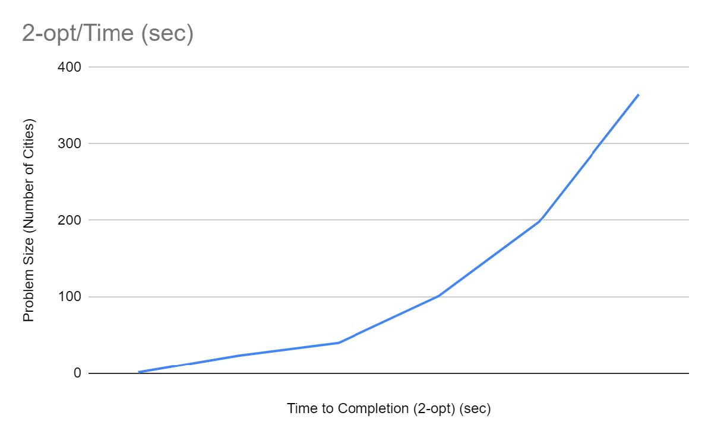

# 2-opt Traveling Salesperson

## Abstract

The 2-opt and 3-opt algorithms are heuristic methods that involve local search algorithms to solve the traveling salesperson problem.
Our algorithms are a combination of both 2-opt and 3-opt local search problems.
This paper will discuss and compare the benefits of 2-opt and 3-opt algorithms in comparison to performance on branch and bound and greedy tsp algorithms as well as an analysis of empirical data from both algorithms.

See [TSPSolver.py](TSPSolver.py#L152) (line 152) for implementaion.

See [Report.pdf](/documentation/2-opt%20TSP%20Group%20Report.pdf) for the full paper/report.

See the [BranchAndBoundTSP Repository](https://github.com/mrchristensen/BranchAndBoundTSP) for the branch and bound approach discussed in the paper.

#### 2-opt Psuedo Algorithm

## Results

#### Comparison

#### 2-opt time-to-completion:

